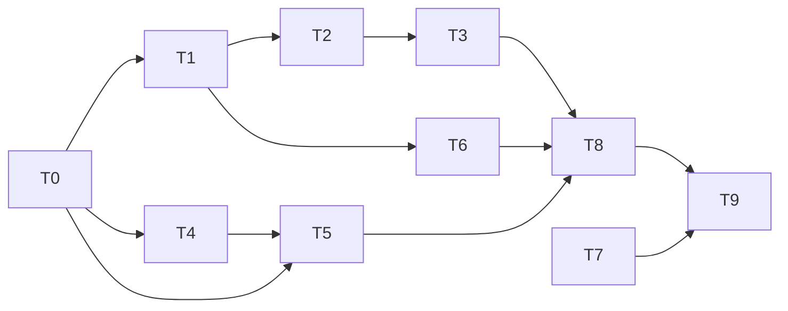

# PassFinder 작업표

요구사항은 `PRD.md`, 계약(API·MCP·데이터)은 `docs/설계.md` 7~8절을 따른다. 모든 시각은 2026-10-03 KST다. 15:00 이후 새 기능을 더하지 않고, 15:20까지 1차 제출 가능한 상태를 만든다.

## 공통 규칙

- [CONTRIBUTING.md](../CONTRIBUTING.md)를 따른다. 최신 main에서 작업별 브랜치를 만들고, 기능 하나가 끝나면 PR을 올린다. Mint가 검토 후 병합한다. main 직접 push는 하지 않는다.
- 역할은 PR #2(5인 역할 분담 초안)의 A~E와 같다. A 서버·통합 = T0, B 교안 처리 = T2, C MCP·문항 검수 = T3, D 학습 화면 = T4·T5, E 이용권·QA·데모 = T6·T7. 다만 단일 `server.js` 대신 기능별 파일로 나눠 같은 파일을 두 사람이 고치지 않게 했다. 기능 추가 중단 시각은 PR #2의 14:40과 이 표의 15:00 중 팀이 하나로 정한다.
- 아래 "수정 파일"에 적힌 자기 파일만 고친다. `lib/` 공통 파일(`supabase-*.ts`, `auth.ts`, `api-client.ts`, `http.ts`)과 `supabase/schema.sql`을 바꿔야 하면 이제민에게 말하고 이제민이 고친다.
- 환경 변수 값은 이제민이 개인 메시지로 준다. `.env.local`은 올리지 않는다.
- API 응답은 설계서 8절 형식을 지킨다. 오류의 `message`는 화면에 그대로 보여 줄 문장이다.
- 기능 변경이 필요하면 PRD → 설계서 → 코드 순서로 고친다. 구현하지 않은 기능을 PRD 결과표에 완료로 적지 않는다.

## 담당

GitHub 계정은 커밋 기록으로 확인한 것(chcg305 박재현, Snow0821 최순호, wpalswpa 이제민)과 이름으로 짐작한 것(yena1717 박예나, 7117wkd 장용선, 확인 필요)이 섞여 있다.

| ID | 담당 | FR | 선행 | 수정 파일 | 입출력 계약 | 완료 기준 | 기한 |
| --- | --- | --- | --- | --- | --- | --- | --- |
| T0 | 이제민 | 공통 | 없음 | `package.json`, `supabase/schema.sql`, `lib/supabase-*.ts`, `lib/auth.ts`, `lib/api-client.ts`, `lib/http.ts`, `lib/rules.ts`, `app/layout.tsx` | 설계서 6~8절 | Supabase 생성·스키마 적용, 첫 배포 주소에서 첫 화면이 열림 | 13:20 |
| T1 | 최순호 | FR-01(가입·과목·참여 코드) | T0 | `app/page.tsx`, `app/api/auth/signup/`, `app/api/courses/route.ts`, `app/api/courses/join/`, `app/api/courses/[id]/route.ts`, `lib/access.ts`, `components/JoinCodePanel.tsx` | 설계서 8절 웹 API 앞 5개 | 새 이메일로 가입 즉시 로그인, 과목 생성 시 참여 코드 표시, 두 번째 계정이 코드로 참여, 없는 코드 안내 | 14:00 |
| T2 | 이제민 | FR-01(교안) | T0, T1의 `lib/access.ts` | `components/MaterialsPanel.tsx`, `app/api/courses/[id]/materials/`, `app/api/materials/[id]/index/`, `lib/embed.ts`, `lib/chunk.ts` | 설계서 8절 교안 API | PDF 업로드 후 "분석 준비 완료(청크 N개)", 실패 파일 4종 안내, 같은 파일 재업로드 안내 | 14:00 |
| T3 | 이제민 | FR-02, FR-03 | T2 | `app/api/mcp/[token]/`, `app/api/mcp-token/`, `lib/mcp/*.ts`, `lib/review.ts`, `components/McpPanel.tsx` | 설계서 8절 MCP | Claude Code에서 도구 7개 호출 성공, 거절 사례 5종, 계정 3개로 검증 완료 전환 | 14:30 |
| T4 | 장용선 | FR-04, FR-05(서버) | T0 | `app/api/courses/[id]/map/`, `app/api/stages/`, `app/api/questions/[id]/report/`, `lib/rules.ts`(T0 이후 소유), `lib/quiz.ts` | 설계서 8절 퀴즈 API, 6절 계산 규칙 | 스테이지 순서·잠금·유료 판정, 5문항 출제(정답 미포함), 채점·클리어·XP·별·숙련도 저장, 신고 3건 숨김 | 14:15 |
| T5 | 박예나 | FR-04, FR-05(화면) | T0(계약만 있으면 시작 가능, T4 전에는 가짜 응답으로) | `app/courses/[id]/page.tsx`, `app/courses/[id]/play/[conceptId]/page.tsx`, `components/StageMap.tsx`, `components/StagePlay.tsx`, `components/StageResult.tsx`, `components/ReviewNotice.tsx` | 설계서 8절 map·stages 응답 | PRD FR-04·05 완료 기준의 모든 문구가 화면에 나옴, 휴대폰 너비에서 가로 스크롤 없음 | 14:30 |
| T6 | 박재현 | FR-06 | T0, T1 | `app/courses/[id]/pay/page.tsx`, `app/api/payments/`, `lib/entitlement.ts` | 설계서 8절 결제 API, `hasAccess(userId, courseId)` | 상품 미선택 비활성, 실패 시험 카드 안내, 성공 시 배지, 재결제 차단, 이중 클릭 1회 처리, 구독 만료 판정 | 14:00 |
| T7 | 박재현 | 제출물 | 없음 | 발표 자료, PRD 결과표(`PRD.md` 마지막 절) | | 발표 5분 구성(문제 1분, 시연 2분, 차별점·사업성 1분, 범위·한계 1분) | 15:30 |
| T8 | 전원 | 필수 FR 전체 | T1~T6 | 각자 파일의 오류 수정만 | | 배포 주소에서 PRD 확인 순서대로 FR-01~06 실행, 결과를 PRD 결과표에 기록 | 15:00 |
| T9 | 이제민·박재현 | 제출 | T8 | `PRD.md` | | 공개 저장소·배포 주소·PRD·발표 자료 4개 제출, "결과물 제출하기" 완료 | 15:20(1차), 15:50(최종) |

## 의존 관계

## 시연 계정과 데이터

- 계정 3개(A 출제자, B·C 검수자)로 FR-03 검증 완료 전환을 보인다. 이메일은 팀이 정해 개인 메시지로 공유하고 문서에 적지 않는다.
- 데모 교안은 팀원이 직접 만든 PDF나 공개 라이선스 자료만 쓴다. 교수님 교안을 공개 배포 주소에 올리지 않는다.

## 남은 결정

| 항목 | 결정할 사람 | 기한 | 미정일 때 영향 |
| --- | --- | --- | --- |
| 팀명(PRD 머리) | 박재현 | 15:00 | PRD 제출본에 빈칸 |
| yena1717·7117wkd 계정 주인 확인 | 이제민 | 13:30 | 커밋 기록과 담당 표 불일치 |
